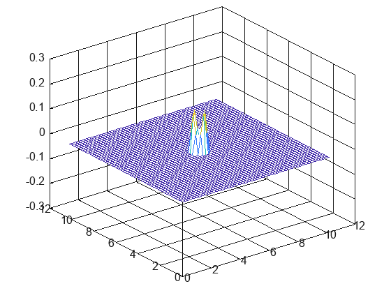

## Dependencies

https://github.com/alandefreitas/matplotplusplus/tree/master?tab=readme-ov-file#cmake

Place entire repo inside a "matplot++/" dir so cmake can add it as a subdirectory and statically link it. Follow directions in the link to set up.

## Build Steps
```
mkdir build
```

```
cmake -S . -B build/ -G "MSYS Makefiles"
```

```
cd build
```

```
make
```

## Notes

https://people.computing.clemson.edu/~dhouse/courses/817/papers/adaptive-h-c16-2.pdf

Currently having issues with grid size and time step needed to be tweaked for each other. Look into adaptive timestep calculation for desired error threshold.

## Sample Output

n x n mesh



m x n mesh


m x n mesh

